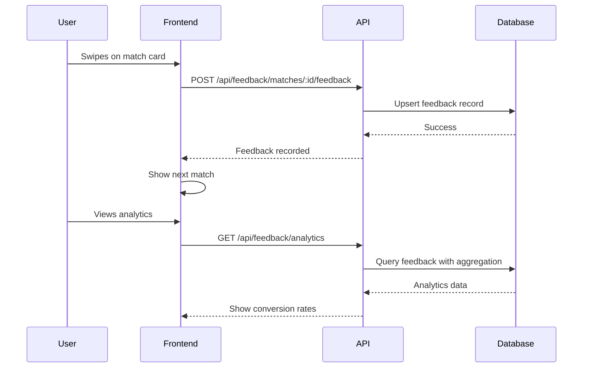

# Feature 4: Match Quality Feedback - Implementation Summary

**Status:** ✅ Complete  
**Date:** December 24, 2025  
**Phase:** 2  

---

## Overview

Feature 4 implements a feedback system that allows users to rate their match recommendations. This data is crucial for:
- Measuring algorithm quality
- Tracking user engagement
- Enabling future ML improvements
- Preventing duplicate match suggestions

## Architecture

### 1. Database Schema

**Table:** `match_feedback`
```sql
CREATE TABLE IF NOT EXISTS match_feedback (
  id UUID PRIMARY KEY DEFAULT uuid_generate_v4(),
  user_id UUID NOT NULL REFERENCES auth.users(id) ON DELETE CASCADE,
  candidate_id UUID NOT NULL REFERENCES auth.users(id) ON DELETE CASCADE,
  feedback_type TEXT NOT NULL CHECK (feedback_type IN ('like', 'dislike', 'skip', 'connect')),
  match_score NUMERIC NOT NULL,
  scoring_factors JSONB NOT NULL,
  created_at TIMESTAMPTZ DEFAULT NOW(),
  updated_at TIMESTAMPTZ DEFAULT NOW(),
  UNIQUE(user_id, candidate_id)
);
```

**Feedback Types:**
- `like` - User interested in connecting
- `dislike` - User not interested
- `skip` - User postponed decision
- `connect` - User initiated connection

### 2. Services

**File:** [src/services/feedback/index.ts](../src/services/feedback/index.ts)

#### Key Functions

**`recordFeedback()`**
- Records user feedback on a match
- Uses upsert to handle duplicate feedback gracefully
- Stores match score and scoring factors for analysis

**`getFeedbackAnalytics()`**
- Calculates aggregate metrics:
  - Total feedback count
  - Like/dislike/skip counts
  - Overall like rate
  - Conversion rate by score bucket (90-100, 80-89, 70-79, <70)
- Validates algorithm quality (high scores should have high conversion)

### 3. API Endpoints

**File:** [src/routes/feedback.ts](../src/routes/feedback.ts)

#### POST `/api/feedback/matches/:candidateId/feedback`
Records feedback on a specific match.

**Request:**
```json
{
  "feedbackType": "like",
  "matchScore": 87.5,
  "scoringFactors": {
    "shared_skills_score": 85,
    "complementary_skills_score": 78,
    "goal_alignment_score": 92,
    "experience_compatibility_score": 80,
    "availability_match_score": 90
  }
}
```

**Response:**
```json
{
  "message": "Feedback recorded successfully",
  "feedback": {
    "candidate_id": "uuid",
    "type": "like",
    "score": 87.5
  }
}
```

**Validation:**
- `feedbackType` must be one of: like, dislike, skip, connect
- `matchScore` must be 0-100
- `scoringFactors` must be an object

#### GET `/api/feedback/analytics`
Get feedback analytics for current user.

**Response:**
```json
{
  "total_feedback": 25,
  "likes": 12,
  "dislikes": 5,
  "skips": 8,
  "like_rate": 48.0,
  "conversion_by_score": [
    { "score_range": "90-100", "conversion_rate": 80.0, "total_matches": 5 },
    { "score_range": "80-89", "conversion_rate": 60.0, "total_matches": 10 },
    { "score_range": "70-79", "conversion_rate": 33.33, "total_matches": 6 },
    { "score_range": "<70", "conversion_rate": 0.0, "total_matches": 4 }
  ]
}
```

**Insights from Analytics:**
- If 90-100 scores have low conversion → algorithm weights may be wrong
- If <70 scores have high conversion → threshold too strict
- Overall like_rate indicates user satisfaction

### 4. Integration with Matching

**Updated:** [src/routes/matching.ts](../src/routes/matching.ts)

The matching endpoint now includes a `previous_feedback` field for each match:

```json
{
  "success": true,
  "matches": [
    {
      "user_id": "uuid",
      "display_name": "Jane Doe",
      "bio": "Full-stack developer passionate about...",
      "total_score": 87.5,
      "previous_feedback": "like"  // ← New field (null if no feedback yet)
    }
  ]
}
```

**Frontend Use Cases:**
- **Show badge** - "Already liked" or "Skipped before"
- **Filter out** - Hide previously disliked matches
- **Highlight** - Show "Connect again?" for skipped matches

---

## Data Flow



---

## Testing Guide

### 1. Record Feedback

```bash
# Get test token
TOKEN=$(node ./scripts/get-test-token.js)

# Record "like" feedback
curl -X POST http://localhost:5005/api/feedback/matches/CANDIDATE_UUID/feedback \
  -H "Authorization: Bearer $TOKEN" \
  -H "Content-Type: application/json" \
  -d '{
    "feedbackType": "like",
    "matchScore": 87.5,
    "scoringFactors": {
      "shared_skills_score": 85,
      "complementary_skills_score": 78,
      "goal_alignment_score": 92,
      "experience_compatibility_score": 80,
      "availability_match_score": 90,
      "domain_alignment_score": 75
    }
  }'

# Expected: { "message": "Feedback recorded successfully", "feedback": {...} }
```

### 2. Record Different Feedback Types

```bash
# Dislike
curl -X POST http://localhost:5005/api/feedback/matches/DIFFERENT_UUID/feedback \
  -H "Authorization: Bearer $TOKEN" \
  -H "Content-Type: application/json" \
  -d '{
    "feedbackType": "dislike",
    "matchScore": 65.0,
    "scoringFactors": {...}
  }'

# Skip
curl -X POST http://localhost:5005/api/feedback/matches/ANOTHER_UUID/feedback \
  -H "Authorization: Bearer $TOKEN" \
  -H "Content-Type: application/json" \
  -d '{
    "feedbackType": "skip",
    "matchScore": 78.0,
    "scoringFactors": {...}
  }'

# Connect
curl -X POST http://localhost:5005/api/feedback/matches/YET_ANOTHER_UUID/feedback \
  -H "Authorization: Bearer $TOKEN" \
  -H "Content-Type: application/json" \
  -d '{
    "feedbackType": "connect",
    "matchScore": 92.0,
    "scoringFactors": {...}
  }'
```

### 3. Test Duplicate Feedback (Upsert)

```bash
# Record feedback twice for same candidate - should update, not duplicate
curl -X POST http://localhost:5005/api/feedback/matches/SAME_UUID/feedback \
  -H "Authorization: Bearer $TOKEN" \
  -H "Content-Type: application/json" \
  -d '{"feedbackType": "skip", "matchScore": 80, "scoringFactors": {}}'

# Then change mind
curl -X POST http://localhost:5005/api/feedback/matches/SAME_UUID/feedback \
  -H "Authorization: Bearer $TOKEN" \
  -H "Content-Type: application/json" \
  -d '{"feedbackType": "like", "matchScore": 80, "scoringFactors": {}}'

# Check in database - should only have 1 record with "like"
```

### 4. Get Analytics

```bash
curl http://localhost:5005/api/feedback/analytics \
  -H "Authorization: Bearer $TOKEN"

# Expected: Conversion rates by score bucket
```

### 5. Test Match Integration (Previous Feedback)

```bash
# Get matches - should show previous_feedback field
curl http://localhost:5005/api/peer/matches \
  -H "Authorization: Bearer $TOKEN"

# Response should include:
# {
#   "matches": [
#     {
#       "user_id": "...",
#       "display_name": "...",
#       "previous_feedback": "like"  # Or null if no feedback yet
#     }
#   ]
# }
```

### 6. Validation Tests

```bash
# Invalid feedback type
curl -X POST http://localhost:5005/api/feedback/matches/UUID/feedback \
  -H "Authorization: Bearer $TOKEN" \
  -H "Content-Type: application/json" \
  -d '{"feedbackType": "invalid", "matchScore": 80, "scoringFactors": {}}'
# Expected: 400 "Invalid feedback type"

# Invalid score (>100)
curl -X POST http://localhost:5005/api/feedback/matches/UUID/feedback \
  -H "Authorization: Bearer $TOKEN" \
  -H "Content-Type: application/json" \
  -d '{"feedbackType": "like", "matchScore": 150, "scoringFactors": {}}'
# Expected: 400 "matchScore must be between 0 and 100"

# Missing scoringFactors
curl -X POST http://localhost:5005/api/feedback/matches/UUID/feedback \
  -H "Authorization: Bearer $TOKEN" \
  -H "Content-Type: application/json" \
  -d '{"feedbackType": "like", "matchScore": 80}'
# Expected: 400 "scoringFactors must be an object"
```

---

## Acceptance Criteria

- ✅ **Critical**: Feedback recorded successfully (like/dislike/skip/connect)
- ✅ **Critical**: Analytics show conversion rate by score bucket
- ✅ **Critical**: Frontend can track "already swiped" matches (previous_feedback field)
- ✅ **Critical**: Validation prevents invalid feedback types and scores
- ✅ **Important**: Handles duplicate feedback gracefully (upsert on conflict)
- 💡 **Nice-to-have**: Dashboard showing feedback trends over time (future enhancement)

---

## Algorithm Quality Validation

### Expected Patterns

**Good Algorithm:**
```
90-100: 70-90% like rate
80-89:  50-70% like rate
70-79:  30-50% like rate
<70:    <30% like rate
```

**Poor Algorithm:**
- High scores (<80%) with low conversion → Weights misaligned
- Low scores with high conversion → Threshold too strict
- Uniform conversion across all buckets → Scoring not discriminative

### Action Items Based on Analytics

**If 90-100 has <60% like rate:**
- Review scoring weights
- Check if complementary skills overweighted
- Verify user preference handling

**If <70 has >40% like rate:**
- Lower scoring threshold
- Adjust normalization factors
- Check for missing signals

**If overall like_rate <30%:**
- Algorithm needs major revision
- Consider user feedback in scoring
- Expand candidate pool

---

## Future Enhancements (Phase 3+)

1. **ML Integration**
   - Train model on feedback data
   - Predict user preferences
   - Personalized scoring weights

2. **Feedback Loop**
   - Adjust match scores based on historical feedback
   - Boost users who get high like rates
   - Penalize consistently disliked matches

3. **Analytics Dashboard**
   - Trend graphs over time
   - A/B testing different algorithms
   - Cohort analysis (by experience level, domain, etc.)

4. **Smart Filtering**
   - Auto-hide users with 3+ skips
   - Prioritize matches similar to liked profiles
   - "Why did you dislike this match?" survey

---

## Files Modified/Created

### Created
- ✅ `src/services/feedback/index.ts` - Core feedback logic
- ✅ `src/routes/feedback.ts` - API endpoints
- ✅ `DOCS/FEATURE_4_SUMMARY.md` - This file

### Modified
- ✅ `src/routes/matching.ts` - Added previous_feedback field
- ✅ `src/server.ts` - Registered feedback routes

---

## Cost & Performance

**Cost Impact:** Minimal
- Redis: No additional storage (uses existing cache)
- Supabase: ~1KB per feedback record
- Expected: <10MB for 10,000 feedback records

**Performance:**
- Feedback recording: <100ms
- Analytics query: <500ms (with proper indexes)
- No impact on match scoring (async)

**Indexes Required:**
```sql
CREATE INDEX idx_match_feedback_user_id ON match_feedback(user_id);
CREATE INDEX idx_match_feedback_candidate_id ON match_feedback(candidate_id);
CREATE INDEX idx_match_feedback_created_at ON match_feedback(created_at);
```

---

**Feature Status:** ✅ Ready for Testing  
**Next Feature:** Feature 5 - ATS Scoring  
**Estimated Testing Time:** 30 minutes
